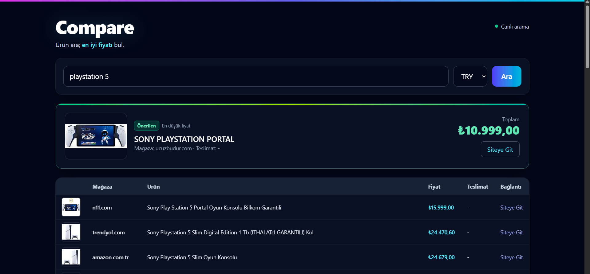

# Project Name

A modern, scalable, and maintainable project structure. Designed with clean code principles and flexible architecture for fast setup, easy development, and long-term sustainability. 🚀

---

## ✨ Features
- Modular and clean codebase  
- Easy configuration & quick setup  
- Well-structured folder organization  
- Cross-platform support  
- Open-source & community-friendly  

---

## 📂 Project Structure
